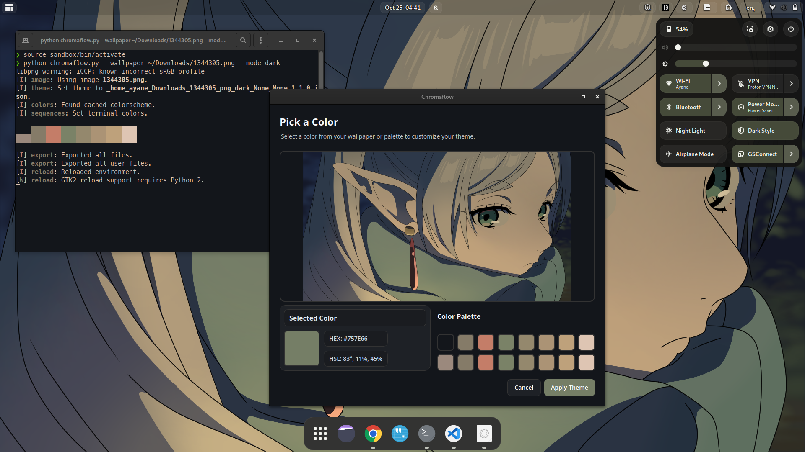

# Chromaflow - A Wallpaper Color Picker for Marble Shell Theme

A GUI tool that extracts colors from your wallpaper and applies them to the Marble GNOME Shell theme. This tool helps you create a cohesive desktop experience by matching your shell theme colors with your wallpaper.

## Features

- Interactive color picker with wallpaper preview
- Integration with pywal color palette
- Real-time color preview
- Support for both light and dark theme modes
- Option for more vibrant accent colors
- Skibidi GUI

## Screenshot


## Prerequisites

- Python 3.6+
- Marble Shell Theme
- pywal
- Required Python packages:
  ```bash
  pip install pillow PyQt5
  ```

## Installation

1. Clone this repository:
   ```bash
   git clone https://github.com/Felixdiamond/chromaflow
   cd chromaflow
   ```

2. Make sure you have the Marble Shell Theme installed and its files are accessible.

3. Copy `chromaflow.py` into marble the Marble Shell Theme github repo.

## Usage

Basic usage:
```bash
python chromaflow.py --wallpaper /path/to/your/wallpaper.jpg
```

Full options:
```bash
python color_picker.py --wallpaper /path/to/your/wallpaper.jpg \
                      --colors-path ./colors.json \
                      --mode dark \
                      --filled
```

### Arguments

- `--wallpaper`: Path to your wallpaper image (required)
- `--colors-path`: Path to Marble theme's colors.json (default: ./colors.json)
- `--mode`: Theme mode, either 'light' or 'dark' (default: dark)
- `--filled`: Use more vibrant accent colors (optional)

## How to Use

1. Run the script with your wallpaper path
2. Click anywhere on the wallpaper image to select a color
3. Alternatively, click on any color from the pywal palette
4. The selected color will be shown in the preview with the hex and hsl
5. Close the window to apply the selected color
6. Follow the on-screen instructions to activate the theme

## Applying the Theme

After running the script:
1. Open the Extensions app
2. Go to 'User Themes' settings
3. Select 'Marble-extracted-dark' (or light) from the dropdown

## Contributing

Feel free to submit issues, fork the repository, and create pull requests for any improvements.

## Future Additions
- Maybe a listener that automatically runs the script when you change your wallpaper idk

## Credits

- Based on the Marble [GNOME Shell Theme](https://github.com/imarkoff/Marble-shell-theme)
- Uses [pywal](https://github.com/dylanaraps/pywal) for color palette generation